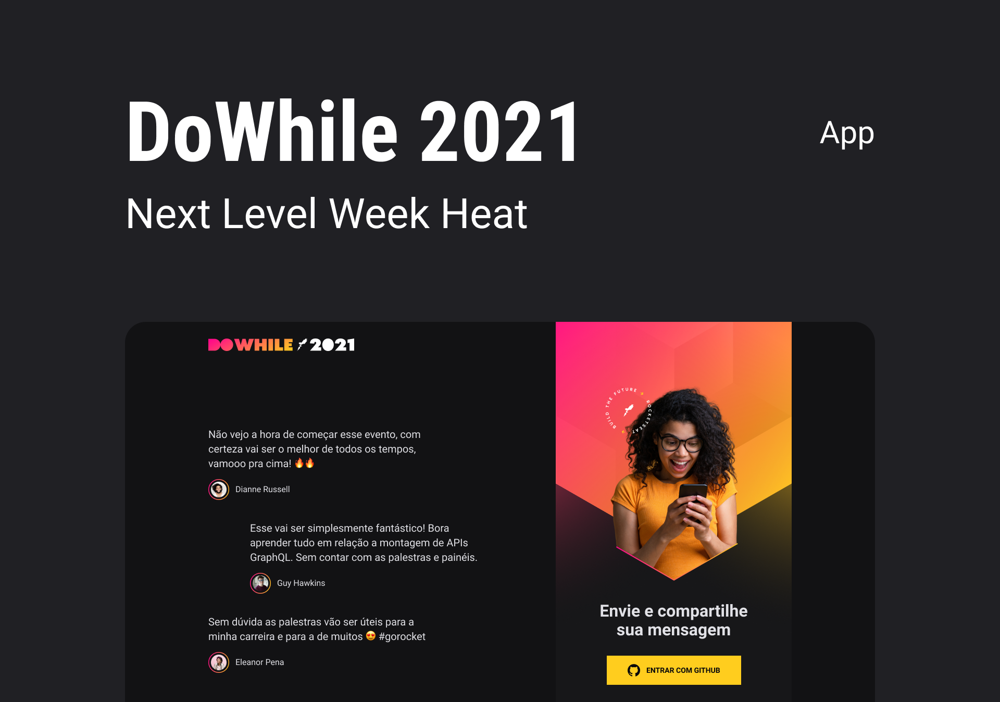

<h1 align="center">NLW Heat - React</h1>

  

<h3 align="center">Esse projeto foi desenvolvido durante a Nlw Heat, e consiste na aplicação Front-end feita com React para o Dowhile 2021 e se trata de uma aplicação de mensagens em tempo real.</h3>

  <a href="https://github.com/alexmuniz96/Nlw-Heat-Node">Você pode conferir o Back-end aqui</a>

  <a href="#-tecnologias">Tecnologias</a>&nbsp;&nbsp;&nbsp;|&nbsp;&nbsp;&nbsp;
  <a href="#-como-executar">Como executar</a>&nbsp;&nbsp;&nbsp;|&nbsp;&nbsp;&nbsp;
  <a href="#-licença">Licença</a>

  
  

## ✨ Tecnologias

Esse projeto foi desenvolvido com as seguintes tecnologias:

- [TypeScript](https://www.typescriptlang.org/)
- [React](https://pt-br.reactjs.org/)
- [Vite](https://vitejs.dev/)
- [JSON Web Token](https://jwt.io/)
- [Socket.IO](https://socket.io/)

## 🚀 Como executar

> Obs.: Nesse projeto depende do back-end em node que você pode [acessar aqui](https://github.com/alexmuniz96/Nlw-Heat-Node)

- Instale as dependências com `yarn`;
- Inicie o servidor com `yarn dev`;

A aplicação pode ser acessada em [`localhost:3000`](http://localhost:3000).

## 📄 Licença

Esse projeto está sob a licença MIT. Veja o arquivo [LICENSE](LICENSE) para mais detalhes.
